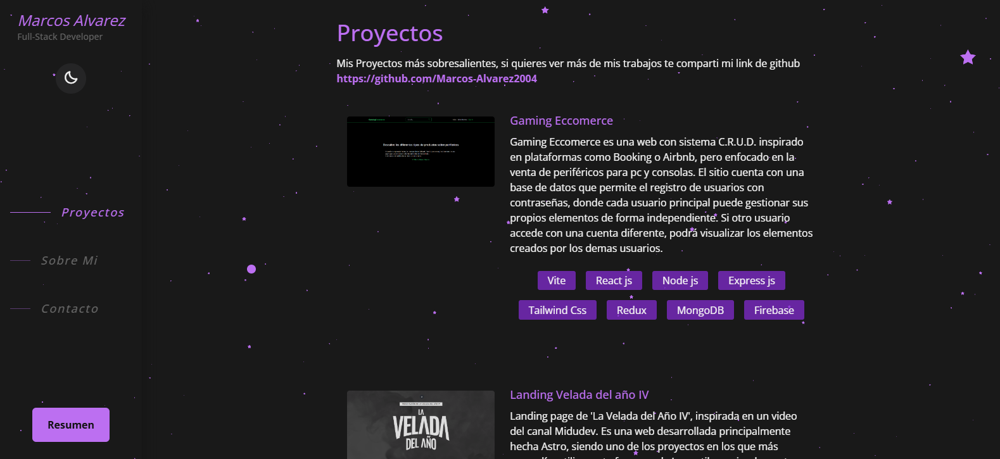

# Portafolio v2

### Portafolio Personal de Marcos Alvarez

Este proyecto está desarrollado principalmente con Astro como framework, complementado con algunas librerías de React y archivos. Para el diseño y los estilos, utilicé TailwindCSS junto con CSS, mientras que Three.js se empleó para crear el fondo animado. La mayoría de las funciones están implementadas en JavaScript para garantizar una experiencia interactiva y dinámica.

# Contacto

Si deseas contactar conmigo, puedes enviarme un mensaje por  o enviame un correo a maaarcosaaalvarez13@gmail.com
